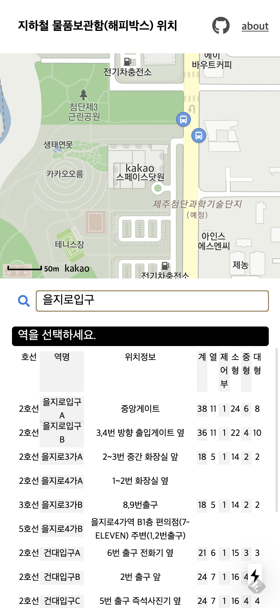

# 지하철 물품보관함 위치

> 아프지마 무릎 😭



지하철 역사의 물품보관함(해피박스) 위치를 지도와 함께 본다

## 로컬 배포
```shell script
npm run build # 데이터 빌드
npm run build.data
npm run publish
```

## 참조
- 지하철 물품 보관함 위치 데이터 2024-02-08
  - https://www.data.go.kr/data/15044234/fileData.do
  - https://www.data.go.kr/data/15044235/fileData.do

## 업데이트 내역
- 2020-02-25
- 2024-02-08